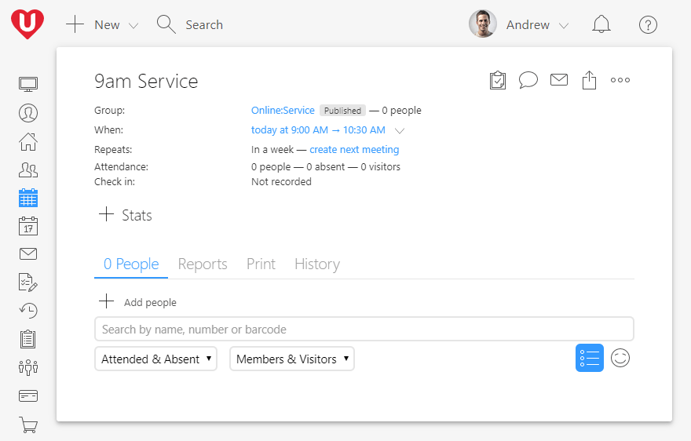
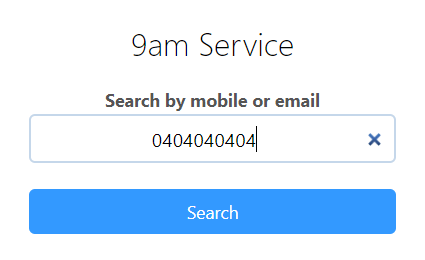
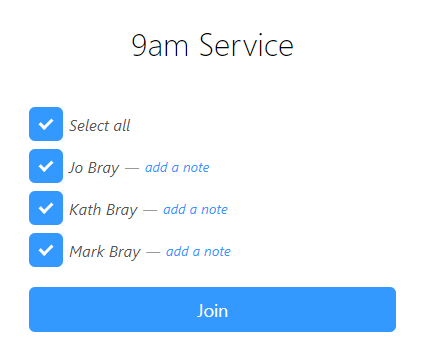

What a week of change!

With restrictions continuing to increase, we've heard from many churches over the last two weeks that you need help to better connect with people online.

Our product team had an unscheduled strategy meeting on March 13 to allow us to pivot our focus to what we can deliver that will help churches most in this next season. We've rolled out a new online check-in option this week. This post also highlights existing features to help you continue to do church.

## Online check-in

Our new online check-in helps track who is participating in your live services. You can use this information to follow up participants, but more importantly, to reach out to those who were missing.
To assist, we have published updates to attendance tracking that allow for rapid online check-in.

The new check-in design allows participants to join your online service quickly. While regular kids check-in typically happens for 15 to 30 minutes, people may join online in just a couple of minutes. We were already developing a new check-in system as part of our UCare Wave upgrades, so repurposed this as it allows UCare to scale with rapid online check-in.

### How do you use the new check-in?

First, create a Group (e.g., Online: Service). But before you save, click **More details** then change the Visibility to "Published" or "Featured".

Next, create a Meeting (e.g., 9am Service). The description is shown on the online check-in page, so add any message or links you want people to see. After you save, there will be a share button in the top right; it looks like a box with an up arrow. Click the share button and copy the **link** or the **embed code**. The link is best used in email, on Facebook, or in the description of your live stream (e.g., YouTube, Church Online, etc.).

If you are embedding Facebook Live, YouTube Live, or another service on your website, then copy the embed code and get your web designer to put it next to the video.

### What do your viewers do?

A viewer enters their mobile number or email and clicks Search. If multiple households have a person with that contact detail, then they need to click on their family.

A list of family members is displayed, and the viewers can unselect any family member not watching. Viewers can also add a note for a family member (e.g., a prayer request), and finally, click Join.

That's it. The whole process should take only a few seconds for existing people.

If UCare can't find a person with the contact detail entered, then the viewers are prompted to register their family. The registration form is called **Published Meetings: Register** and is found in the Forms area of UCare. You can customize this form, change the questions, or have it add those who register to a follow-up process. Some churches have a process that sends an automated SMS thanking the person for joining with more info for connecting with the pastoral care team.

Now you'll know which families joined the live stream, be able to connect them to a small group, or follow-up with the people who are disconnected.

## Include giving options

While people may not be attending a service in person, they can still contribute to the mission of your church. These days many people use their bank to set up automated giving, you should encourage this as much as possible as there are no transaction fees that tax people's giving.

For those that want to give via credit card, [add a payment form link in the description](https://help.ucareapp.com/hc/en-us/articles/201955194-Add-a-payment-form-to-your-website-or-app) of your online meetings. Alternatively, you can send an email newsletter to all those who joined your online service with more resources, news, and links to the payment form.

## Small group check-in

If your small groups have gone virtual on Microsoft Teams, Zoom, Skype, or a similar video call service, then your leaders can already use attendance reports to record who is on the call and to submit individual notes and prayer requests.

We mentioned this in the previous post, but we want to include a reminder as it's so valuable to know who in your church is connected and disconnected:

- [Give your service small groups a new type](https://help.ucareapp.com/hc/en-us/articles/202204060-Add-a-group). For example, while you may have existing small groups under the "Small group" type, you could create new groups under the type "Small group service."
- If the group is meeting online via Microsoft Teams (or similar service), then in the group "where" field paste the URL for your online team.
- Have group leaders [complete an attendance report](https://help.ucareapp.com/hc/en-us/articles/202204240-Record-small-group-attendance-video-); the report will be sent via email, avoiding the need for group leaders to have a password. The leaders can even search for new attendees by phone number, helping avoid duplicates for existing profiles. An attendance summary email is sent after reports are saved; the summary allows the leader to see who needs follow-up quickly.
- [Publish your groups](https://help.ucareapp.com/hc/en-us/articles/204759194-Share-published-groups-to-your-website-or-app) to your website, mobile app, or Socials so that people can find a group in their area and then contact a leader to get connected.

## What else do you need?
We'll continue to innovate in the area of online-church over the coming weeks. To help ensure we are heading in the right direction, [please take a few minutes to tell us what would be of most benefit to your church](https://crm.ucareapp.com/forms/26/embed?iframe=true&title=false).

Church leader, you've got this! And, we're here to help you where we can.

Blessings,

The UCare Team
