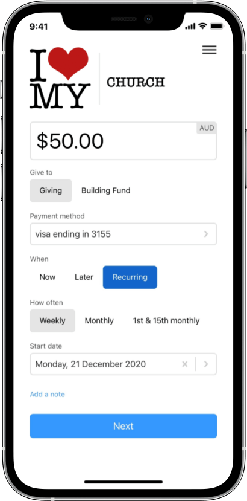

For Christmas this year we wanted to give our churches a gift, so we're giving you the gift of giving.

Introducing UCare Giving, the easiest way for your people to give.

Empower your people to give recurring or one-off payments via any method in their local currency.

## Why use UCare Giving?

### Simplicity

Create simpler giving experiences to empower giving from anywhere, anytime.

Automate receipts and transaction statements for tax purposes.

For fast donations, people can sign-in using an emailed or SMSed security code. Your people never need to worry about forgotten passwords again.

### Security

Create trusted, private transactions for direct debit, credit cards, Google Pay, and Apple Pay.

Allow donors to update or cancel recurring donations or their details.

### Stewardship

Forecast a more accurate cash flow with predictable recurring gifts.

Best of all, our transaction rates are the lowest we've seen anywhere. A typical 500 member church using the most common payment app for Churches can save up to $8,000+/month.

Other Giving tool companies take from your mission by charging expensive transaction fees. UCare Giving is different; we add no transaction fees.

## Get started today

Helping your people give is now as simple as:

1. Register with Stripe if you haven't already. It's free to register and only takes 5 minutes.
2. Set up your UCare Giving form
3. Copy and paste the form code on your website or church app.
4. Receive donations.

Visit our [help center and get started with UCare Giving today](https://help.ucareapp.com/hc/en-us/articles/360002342776#h_01ET70MTMGJM6VDVZ2349T8W8E).

# From the UCare team, Thankyou
Our team here at UCare want to again say thank you for partnering with us in 2020. We love serving you and are looking forward to continuing to support your mission in 2021 and beyond.

Merry Christmas, 
The UCare Team