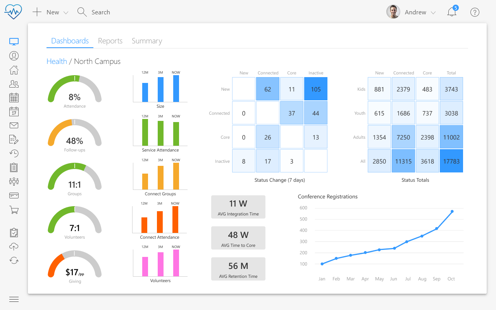

## Reporting reimagined

Healthy churches grow, but the question then is, do you know what health looks like for your church? For instance, do you have five key indicators of church health, or do you want more detail?

If you can’t measure church health, you can’t improve it. And yet, as Pastor Craig Groeschel has said, "It’s difficult to measure success in leading people spiritually. How do you accurately gauge if people are growing closer to God?" Numerical growth alone is not a good indicator of health; you need a broader picture to know what happens in people’s hearts.

Once you have started defining what church health looks like, how is it surfaced and communicated? Dashboards displaying your vitals tell the story of church health, empowering leaders to make more strategic and better-informed decisions.

Analytics has been developed on top of Microsoft Power BI, the most powerful business intelligence platform available.

With Wave Analytics, churches can capture valuable insights for discipleship and church health through powerful and beautiful charts and interactive dashboards. And because it uses such a powerful platform, the scope of the custom visualizations churches can create far exceeds anything available in other Church Management Systems today.

